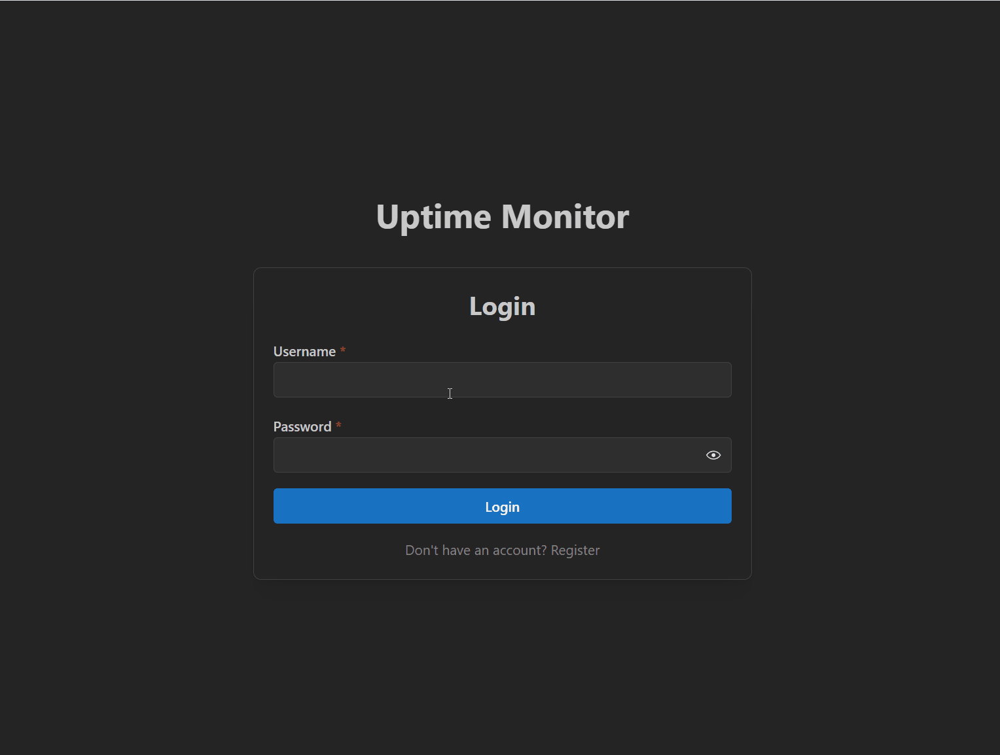

# 🖥️ Uptime Monitor (UI)


This is the official React + TypeScript frontend for the [Uptime Monitor API](https://github.com/MatheusBarbosaSE/uptime-monitor).

It provides a complete, modern, and responsive user interface for users to log in, register, and manage their website monitoring targets. The interface is built using the **[Mantine](https://mantine.dev/)** component library for a professional look and feel, including a dark mode by default.

---

## 📸 Visual Demo



---

## 📑 Table of Contents

- [Description](#-uptime-monitor-ui)
- [Visual Demo](#-visual-demo)
- [Features](#-features)
- [Installation & Usage](#-installation--usage)
- [Project Structure](#-project-structure)
- [Technologies Used](#-technologies-used)
- [Contributing](#-contributing)
- [License](#-license)

---

## ✨ Features

- ✅ **Full Authentication Flow:** Login and Registration pages with JWT handling.
- ✅ **Full CRUD:** Create, Read, Update, and Delete targets directly from the UI.
- ✅ **Account Management:** Users can update their profile (username, email) and change their password.
- ✅ **History Reports:** A dedicated page to view target history with pagination and date filters.
- ✅ **Modern UI/UX:** Built with Mantine for a professional, responsive design (dark mode default).
- ✅ **Error Handling:** Provides clear feedback for API or validation errors.

---

## ⚙️ Installation & Usage

### Requirements
- [Node.js](https://nodejs.org/) (v20+)
- [npm](https://www.npmjs.com/)
- The **[Uptime Monitor Back-end API](https://github.com/MatheusBarbosaSE/uptime-monitor)** must be running on `http://localhost:8080`.

### 1. Back-end Configuration (CORS)

Before you can use this frontend, you must configure the **Back-end API** to accept requests from this app.

In your Java project (`uptime-monitor`), open `src/main/java/.../config/SecurityConfig.java` and ensure the `corsConfigurationSource` Bean is allowing the correct origin:

```java
// In your Java SecurityConfig.java
configuration.setAllowedOrigins(List.of("http://localhost:5173"));
// Note: 5173 is the default port for Vite. Change if yours is different.
```

### 2. Frontend Installation

```bash
# Clone this repository
git clone [https://github.com/MatheusBarbosaSE/uptime-monitor-ui.git](https://github.com/MatheusBarbosaSE/uptime-monitor-ui.git)
cd uptime-monitor-ui

# Install all dependencies (React, Mantine, Axios, etc.)
npm install
```

### 3. Running the App

```bash
# Start the development server
npm run dev
```
The app will open in your browser at `http://localhost:5173`.

---

## 📂 Project Structure

```bash
uptime-monitor-ui/
│
├── demo/                 # Media used in README
├── public/               # Static assets
├── src/
│   ├── assets/           # Images, SVGs (currently empty)
│   ├── components/       # Reusable React components
│   │   ├── AccountPage.tsx   # User profile management page
│   │   ├── App.tsx       # Main app layout and routing logic
│   │   ├── CreateTarget.tsx  # Form for new targets
│   │   ├── Dashboard.tsx   # Main dashboard (list targets)
│   │   ├── EditTarget.tsx    # Form for updating targets
│   │   ├── Login.tsx       # Login form
│   │   ├── Register.tsx    # Registration form
│   │   └── TargetHistory.tsx # History page component
│   │
│   ├── services/         # API logic
│   │   └── apiService.ts   # Axios client (all API calls)
│   │
│   ├── types/            # TypeScript type definitions (DTOs)
│   │   ├── auth.types.ts
│   │   ├── history.types.ts
│   │   ├── target.types.ts
│   │   └── user.types.ts
│   │
│   ├── App.css           # (Empty)
│   ├── index.css         # (Empty)
│   └── main.tsx          # Main entry point (renders App)
│
├── .gitignore            # Ignore rules for Git
├── index.html            # The single HTML page shell
├── LICENSE               # MIT License
├── package.json          # NPM dependencies (like pom.xml)
├── package-lock.json     # NPM dependency lock file
├── README.md             # Project documentation
└── tsconfig.json         # TypeScript configuration
```

---

## 🛠 Technologies Used

- [React](https://react.dev/)
- [TypeScript](https://www.typescriptlang.org/)
- [Vite](https://vitejs.dev/) (Build Tool)
- [Mantine](https://mantine.dev/) (UI Component Library)
- [Axios](https://axios-http.com/) (HTTP Client)
- [Tabler Icons](https://tabler-icons.io/)

---

## 🤝 Contributing

1. Fork the repository
2. Create a feature branch (`git checkout -b feature/new-feature`)
3. Commit your changes (`git commit -m 'feat: add new feature'`)
4. Push to the branch (`git push origin feature/new-feature`)
5. Open a Pull Request

Feel free to open **issues** for bug reports or suggestions.

---

## 📄 License

This project is licensed under the **[MIT License](LICENSE)**.  
You are free to use, copy, modify, and distribute this software, provided you keep the original credits.